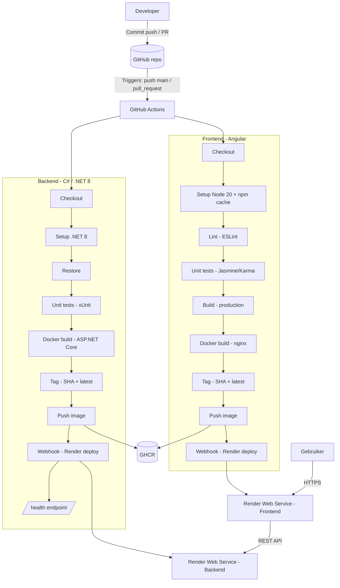

```mermaid
flowchart TB
  Dev[Developer] -->|Commit push / PR| Repo[(GitHub repo)]
  Repo -->|Triggers: push main / pull_request| GA[GitHub Actions]

  GA --> FE_start
  GA --> BE_start

  subgraph FE[Frontend - Angular]
    direction TB
    FE_start[Checkout] --> FE_node[Setup Node 20 + npm cache]
    FE_node --> FE_lint[Lint - ESLint]
    FE_lint --> FE_test[Unit tests - Jasmine/Karma]
    FE_test --> FE_build[Build - production]
    FE_build --> FE_docker[Docker build - nginx]
    FE_docker --> FE_tag[Tag - SHA + latest]
    FE_tag --> FE_push[Push image]
    FE_push --> FE_hook[Webhook - Render deploy]
  end

  subgraph BE[Backend - C# / .NET 8]
    direction TB
    BE_start[Checkout] --> BE_dotnet[Setup .NET 8]
    BE_dotnet --> BE_restore[Restore]
    BE_restore --> BE_test[Unit tests - xUnit]
    BE_test --> BE_docker[Docker build - ASP.NET Core]
    BE_docker --> BE_tag[Tag - SHA + latest]
    BE_tag --> BE_push[Push image]
    BE_push --> BE_hook[Webhook - Render deploy]
    BE_hook --> BE_health[/health endpoint/]
  end

  FE_push --> GHCR[(GHCR)]
  BE_push --> GHCR

  FE_hook --> RenderFE[Render Web Service - Frontend]
  BE_hook --> RenderBE[Render Web Service - Backend]

  User[Gebruiker] -->|HTTPS| RenderFE
  RenderFE -->|REST API| RenderBE
```
